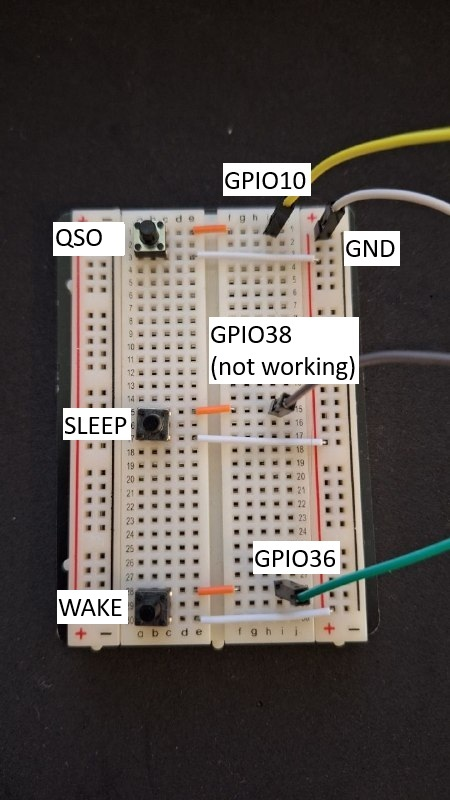
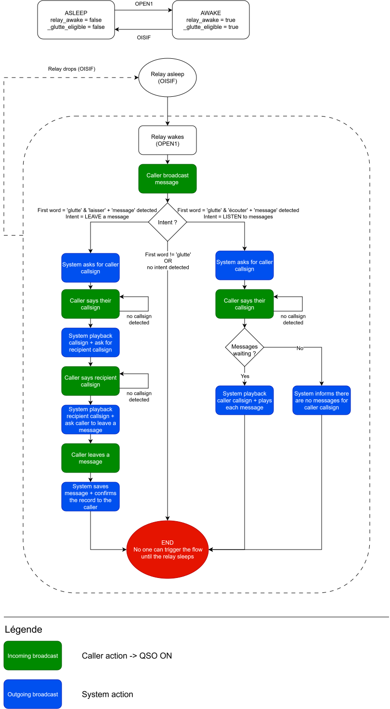
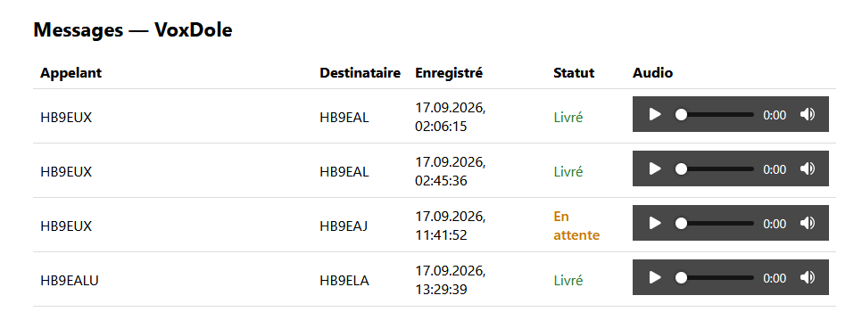

# VoxDole

VoxDole is an automated voicemail system for the [Glutte VHF relay on the Massif de la Dole](https://github.com/Glutte).
built as part of my Bachelor thesis at HEIG-VD.

When someone can't reach the person they're
calling over the relay, they can leave them a voice message instead, and the recipient can
call back later to hear it. All through using the relay as you would normally, but voicemails can also be seen through the simple web application.

This project was built with the [Luna SL1680](https://labs.toradex.com/projects/luna-sl1680) board in mind so the code can be specific (eg. GPIO pins integration)

## Project layout

The code is split into two parts. 


`onboard/` is everything that goes on the board:
it's a self-contained Docker build, so it can be copied over and built there directly.


`outboard/` is tooling for development and pre-deployment. Such as generating the audio clips for the app with the text-to-speech.

## Getting set up (on your computer)

```bash
python -m venv .venv
.venv/Scripts/activate
pip install -r outboard/requirements.txt
```

### Getting the TTS voice model + audio clips

Download it yourself and place it in `outboard/models/piper/`:

```bash
mkdir -p outboard/models/piper
curl -L -o outboard/models/piper/fr_FR-siwis-medium.onnx \
    https://huggingface.co/rhasspy/piper-voices/resolve/main/fr/fr_FR/siwis/medium/fr_FR-siwis-medium.onnx
curl -L -o outboard/models/piper/fr_FR-siwis-medium.onnx.json \
    https://huggingface.co/rhasspy/piper-voices/resolve/main/fr/fr_FR/siwis/medium/fr_FR-siwis-medium.onnx.json
```
_note: other piper models can be used here if you do not like siwis_

Then generate the voice clips:

```bash
cd outboard
python generate_tts.py
```

This reads through `tts_manifest.txt` and writes one `.wav` file per line into
`onboard/assets/tts/`. You are free to change the sentences in the manifest.

## Deploying to the board

```bash
scp -r onboard torizon@<BOARD_IP>:~/voxdole
ssh torizon@<BOARD_IP>
cd ~/voxdole
docker compose build
```

### Configuration

Before starting the app, two things in `docker-compose.yml`'s `command:` need to be set for
your actual hardware: audio devices, and where the relay's signals come from.

#### Audio devices

```bash
docker run --rm -it --device /dev/snd voxdole:latest --list-devices
```
Find your mic and speaker in the list, then set them:
```yaml
command: ["--input-device-name", "YOUR_MIC", "--output-device-name", "YOUR_SPEAKER", ...]
```
Device indices shift around across reboots, which is why `--input-device-name` and
`--output-device-name` match by a substring of the device's name instead of a fixed index.

_Note : as I2S input/output are not handled **yet** you will need to know which device you want your input/outputs_

#### Relay signal

Two options for `--relay-signal`:

**Keyboard** (default, no hardware needed):
```yaml
command: [..., "--relay-signal", "keyboard"]
```
Then type `QSOON`/`QSOOFF`/`OPEN1`/`OISIF` in the attached terminal to simulate the relay (more info lower). 


**Real GPIO pins**, once wired up:
```yaml
command: [..., "--relay-signal", "gpio",
          "--relay-qso-chip", "/dev/gpiochipN", "--relay-qso-line", "N",
          "--relay-wake-chip", "/dev/gpiochipN", "--relay-wake-line", "N",
          "--relay-sleep-chip", "/dev/gpiochipN", "--relay-sleep-line", "N"]
```

Currently, the project is wired as is for testing the pins :


Sadly, there is no official documentation as to what pins maps to what gpiochip + offset (yet ?). So manual searching was done and only 2 GPIO pins (the default ones) matchs were found so far :

| Signal | Board pin | GPIO chip | Line |
|--------|-----------|-----------|------|
| QSO    | GPIO10    | `/dev/gpiochip2` | 10 |
| WAKE   | GPIO36    | `/dev/gpiochip0` | 4  |
| SLEEP   | GPIO38 (or 37,39)    | `unknown` | unknown  |

To remedy this, the current code has ``WAKE`` and `SLEEP` sharing the same button/pin to alternate between the states. 

**Buttons & commands** equivalency :
| Keyword | GPIO buttons | Simulates relay |
|--------|-----------|-----------|
| QSOON    | hold down QSO |relay ``in QSO`` state |
| QSOOFF    | release QSO |relay ``exits QSO`` state|
| OPEN1   | press WAKE    | relay enters ``OPEN1`` state |
| OISIF   | press SLEEP*    | relay enters ``OISIF`` state | 

_*As stated before, WAKE and SLEEP share the same button at the moment. So pressing WAKE when the relay is awake will send SLEEP instead_

### Running it

```bash
docker compose up -d --build
```

`docker-compose.yml` runs two containers: `voxdole-app` (the voicemail) and `voxdole-web` (the web archive, on port 8080).

And you can access/see the logs by attaching to the container :
```bash
docker attach voxdole-app
```

## Call Flow
The flow of the app is as follows :


### Example interactions:
#### Leaving a message
_Note: the STT only listens when in QSO. So when the caller is supposed to speak the ``QSO`` button needs to be held down. This is to simulate the relay sending a continuous signal to the ``QSO`` pin when the relay is in the QSO state (see the `glutte github` for more info)_
```md
*Relay wakes up*

Caller : Glutte, j'aimerais laisser un message.
System : Ici Glutte, veuillez donner votre indicatif.

Caller : Hotel Bravo Neuf Alpha Bravo Charlie.
System : Bien reçu Hotel Bravo Neuf Alpha Bravo Charlie, quel est l'indicatif du destinataire ?

Caller : Hotel Bravo Neuf Uniform Xray Lima.
System : Le message sera délivré à Hotel Bravo Neuf Uniform Xray Lima. Veuillez le laisser après ce message.

Caller : Salut, rappelle-moi quand tu as un moment, merci !

System : Message enregistré. Au revoir.

```

To simulate, here is the flow with the button inputs :
```md
> press WAKE
*relay wakes up*

> hold down QSO
Caller : Glutte, j'aimerais laisser un message.
> release QSO
System : Ici Glutte, veuillez donner votre indicatif.

> hold down QSO
Caller : Hotel Bravo Neuf Alpha Bravo Charlie.
> release QSO
System : Bien reçu Hotel Bravo Neuf Alpha Bravo Charlie, quel est l'indicatif du destinataire ?

> hold down QSO
Caller : Hotel Bravo Neuf Uniform Xray Lima.
> release QSO
System : Le message sera délivré à Hotel Bravo Neuf Uniform Xray Lima. Veuillez le laisser après ce message.

> hold down QSO
Caller : Salut, rappelle-moi quand tu as un moment, merci !
> release QSO

System : Message enregistré. Au revoir.
```

#### Listen to messages
```md
> press WAKE
*relay wakes up*

> hold down QSO
Caller : Glutte, j'aimerais écouter mes messages.
> release QSO
System : Ici Glutte, veuillez donner votre indicatif.

> hold down QSO
Caller : Hotel Bravo Neuf Uniform Xray Lima.
> release QSO
System : Messages pour Hotel Bravo Neuf Uniform Xray Lima.
System : Message de Hotel Bravo Neuf Alpha Bravo Charlie.
System : *plays back the recorded message*
System : Fin de vos messages. Au revoir.
```

## Web App
A separate very simple web archive is also deployed on the board, accessible at ``http://<BOARD_IP>:8080``.
It displays the messages left to the voicemail with timestamp, caller and recipient identifiers and allows the listening of the messages.

